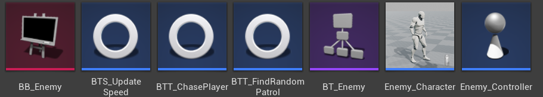
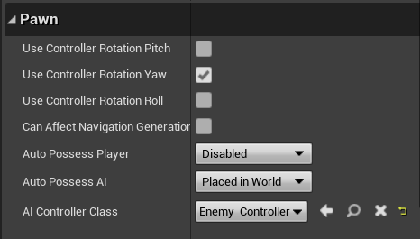
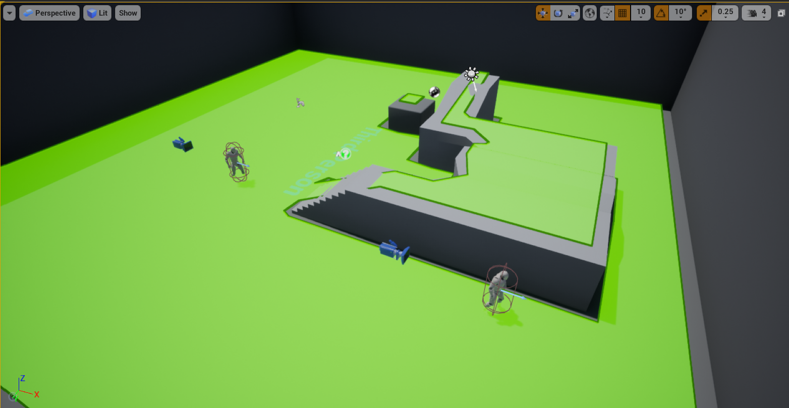
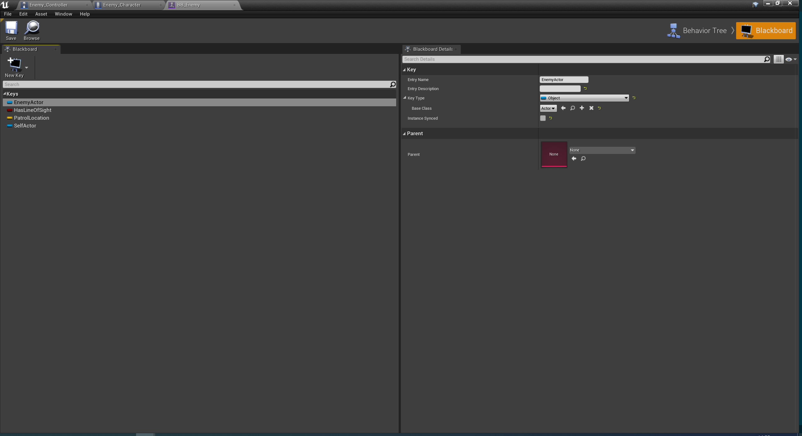
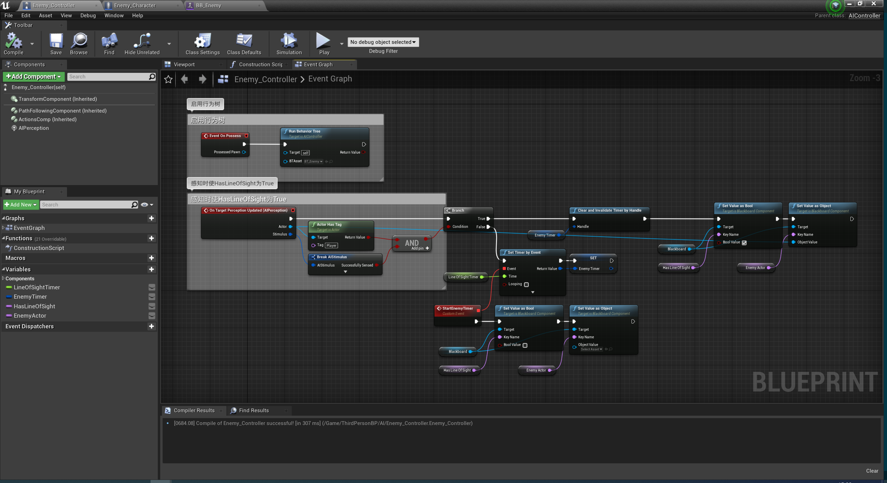
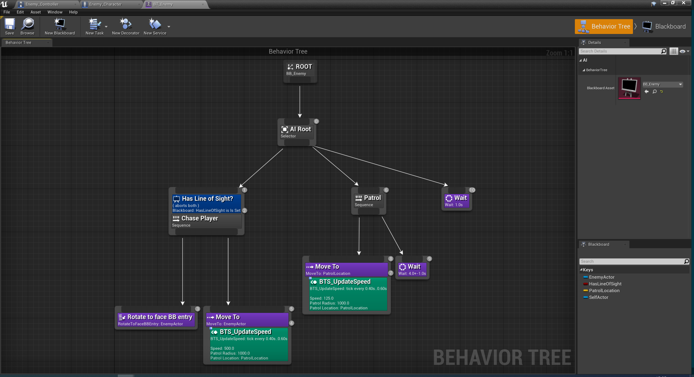
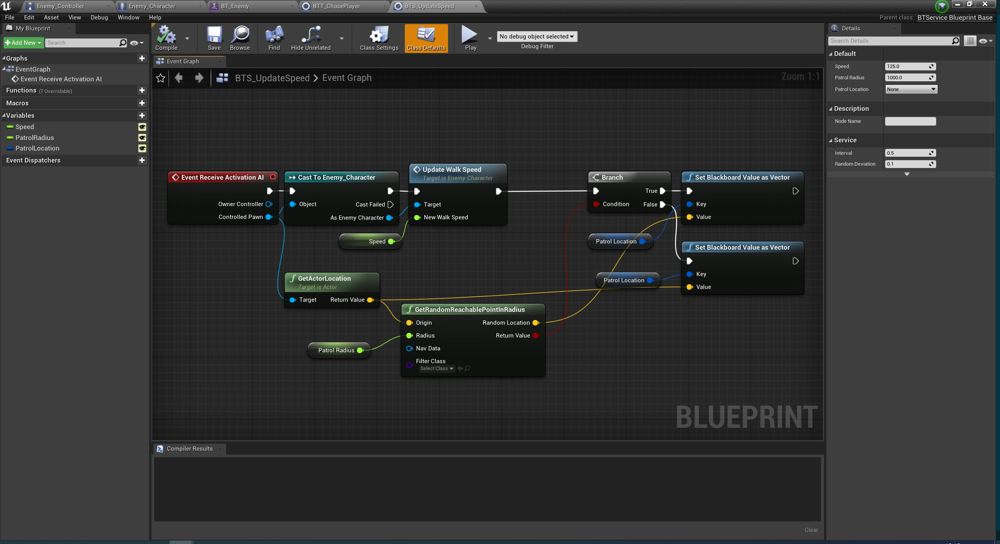
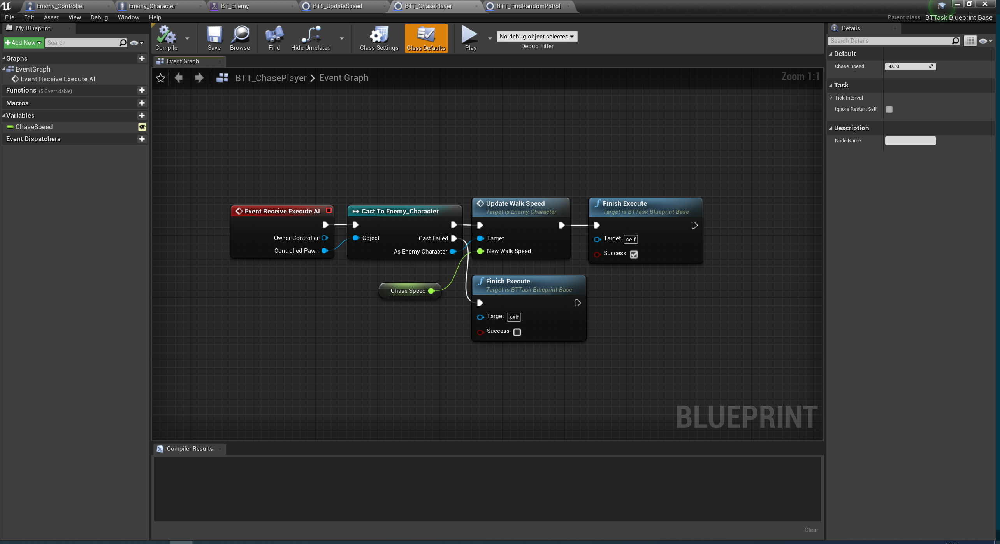
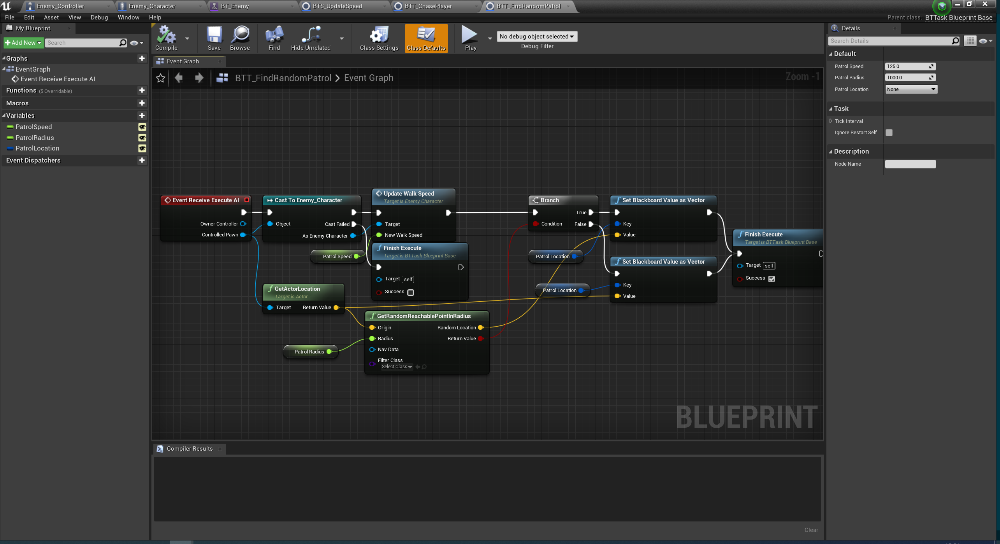

# UE4_BehaviorTrees
UE4.24行为树，20200610

## 0. 概念
- AI控制器AIControllers：启用行为树，控制感知时候的flag
- 黑板Blackboard：声明变量
- 行为树BehaviorTrees：事件逻辑
- 行为树任务节点BehaviorTreeServices：任务
- 行为树装饰器节点BehaviorTreeDecorators：附在任务节点前，条件语句，决定能否执行
- 行为树服务节点BehaviorTreeServices：附在任务节点后，更新黑板建的值

要使用行为树，首先新建蓝图继承AIController，让需要AI的角色使用这个AI控制器。新建黑板，新建行为树，行为树的BlackboardAsset选为这个黑板。场景中需要包含寻路网格体碰撞体积NavMeshBoundsVolume，快捷键P查看导航区域绿色。

## 1. 黑板
声明变量（键），在行为树中使用和更新。

## 2. AI控制器
1. 启用行为树
2. 感知发生时，将黑板中HasLineOfSight值设置True；否则在经过LineOfSightTimer时间后设置为False

## 3. 行为树
当HasLineOfSight==True时，开始ChasePlayer：先转向面对EnemyActor，然后MoveTo它的位置并更新速度为快速度500。否则进行巡逻Patrol，MoveTo巡逻位置PatrolLocation，之后等待4±1秒。如果追踪和巡逻都失败，进行Wait1秒。

这里两个MoveTo任务使用了自定义服务节点，也可以分开使用自定义任务节点。

- 灰色是合成节点Composites，控制树的流程
- 蓝色是装饰器节点，用于条件判断
- 紫色的任务节点，用于做点什么
- 绿色是服务节点，用于更新BB的键值

## 4. 自定义服务节点
入口是EventReceiveActivationAI，不需要返回值。用于更新角色速度和巡逻位置。

## 5. 自定义任务节点
入口是EventReceiveExecuteAI，用FinishExecute返回执行结果。BTT_ChasePlayer用于更新追踪速度，BTT_FindRandomPatrol用于更新巡逻速度和巡逻位置。

约定蓝图前缀BTT表示任务节点，BTD表示装饰器节点，BTS表示服务节点

## 999. 参考资料
官方文档：https://docs.unrealengine.com/zh-CN/Engine/ArtificialIntelligence/BehaviorTrees/index.html